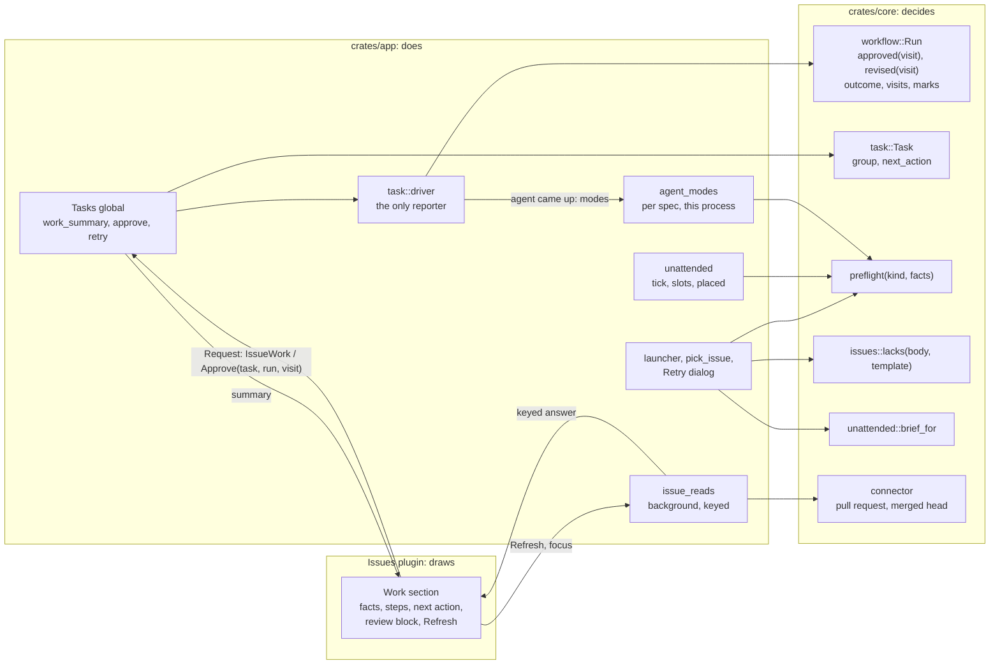
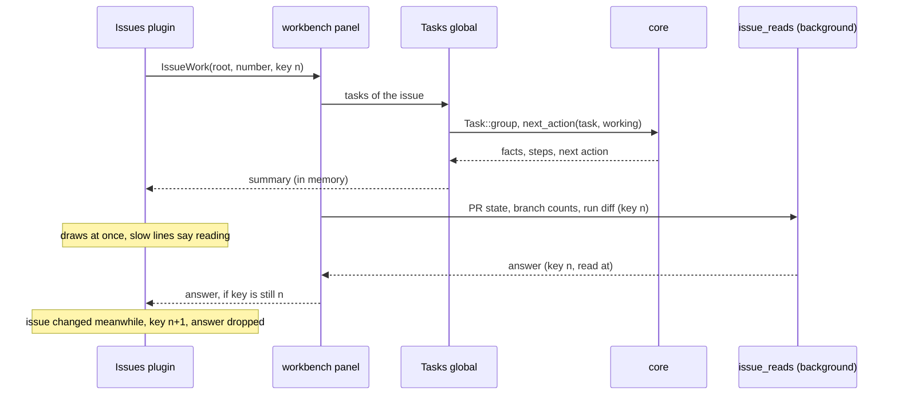
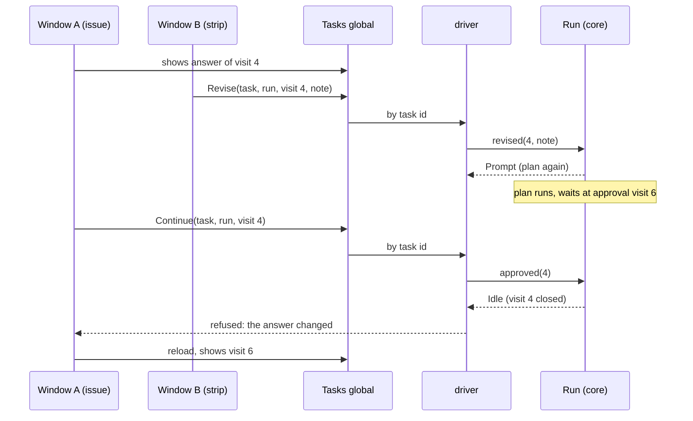
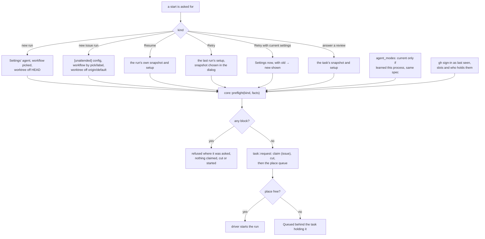
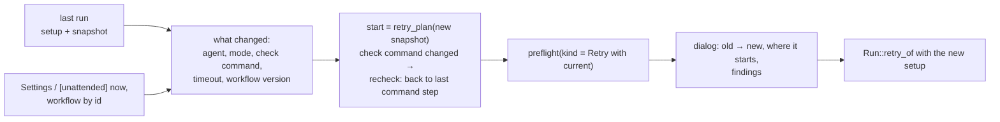

# Architecture of the proposal

- Status: proposal, the shape of every piece together. Part of [the proposal](README.md).
- The split is the one the code already has: **core decides, the app does, a plugin draws.** Every
  new rule below is a pure function in `crates/core`; the app gathers its inputs and carries out its
  answer; the Issues plugin draws what it is told through `onehand-plugin-host`.

## Where each part goes

Existing parts are plain; what the proposal adds is marked `+`, what it changes `~`.

```
crates/core (GUI-free, blocking)            crates/app (GPUI)                       plugins/builtin/workbench-issues
───────────────────────────────────         ─────────────────────────────────       ────────────────────────────────
workflow::run                               task (the Tasks global)                 view/detail.rs
  Run, Visit, Marks, Outcome                  rows, attention, issue_runs             ~ runs_view → Work section
  ~ approved(visit) / revised(visit, note)    ~ approve / revise by task + visit        + three facts, steps, next action
  ~ Outcome::Failed { kind, why }  (B)        + work_summary(task) → plugin           + Refresh, "read Xm ago"
  + Run::pull_request              (B)        + retry_with_current(task)              + review block (piece 4)
  + Visit::command                 (B)      task::driver                              + template picker in the form
  retry_of, retry_plan, recheck               ~ routes actions by task id
task                                          ~ records failure kind, PR, command     crates/plugin-host (workbench.rs)
  Task, group, history                      unattended                                Request::IssueRuns
  + next_action(task, working)                ~ placed() on a lost window (fix)       ~ IssueRun grows, or
  + work facts: run diff vs branch diff       + slots() for who holds each            + Request::IssueWork { key, .. }
+ preflight                                 + agent_modes (per spec, process only)    + IssueRun actions carry visit id
  + preflight(kind, facts) → findings       shell/workflows.rs
issues                                        launcher, begin_retry
  LocalIssue, Draft, open_across              ~ draws preflight findings
  + templates (shipped, project's own)        + Retry with current settings dialog
  + lacks(body, template) → headings        dialogs.rs (pick_issue)
  + across(state)            (pages)          + preview + instructions for this run
unattended                                    + preflight findings
  brief_for, Verdict, report                workbench/panel.rs
  ~ brief_for(.., extra instructions)         ~ broadcast + answer keyed reads
connector                                   + issue_reads (background, keyed)
  pull request by branch, merged head         PR state, branch counts, diffs
```

`(B)` is piece 1 part B: new persistence, optional fields in the task file.

## The parts and who calls whom



## Flow: an issue opened

What the Work section draws, and where each line comes from. In memory per frame, except the reads
that need git or the forge.



Asked again on *Refresh*, on the task moving (`IssueRuns` broadcast), and on the window regaining
focus when what is shown is older than a minute.

## Flow: an approval from anywhere

One path for the strip, the task detail and the issue. The visit id is what keeps a stale view from
approving an answer it never showed.



## Flow: a start, through the preflight

Every kind of start asks the same function with its own configuration; only a block stops it.



A full slot is a block, never a wait: only a place queues.

## Flow: Retry with current settings



*Retry* itself is unchanged: `retry_of` with the last run's setup.

## What is stored, and where

```
<config_dir>/onehand/tasks/<id>.json        one per task, as today
  runs[]
    outcome          ~ Failed { kind, why }            kind absent in older files → other
    pull_request     + { number, url }                 absent → looked up by branch
    visits[]
      command        + { passed, exit, tail, at }      absent → "not recorded"

<workspace storage>/issues/<project>.json   unchanged: no progress kept on an issue (issues::file_for)

in memory, this process only
  agent_modes        + spec fingerprint → modes offered
  issue reads        + key → (answer, read at)
```

Nothing else is persisted. Progress, the next action, the three facts and every preflight finding
are worked out each time from what is above.
