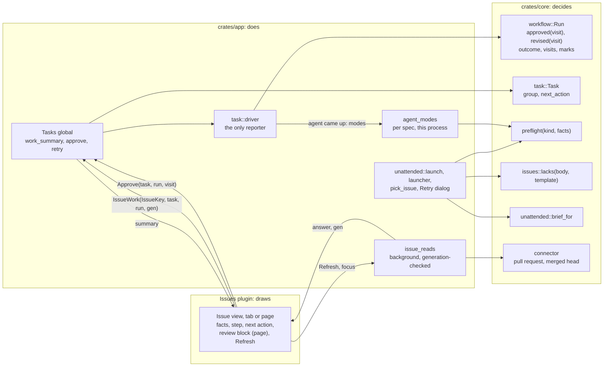
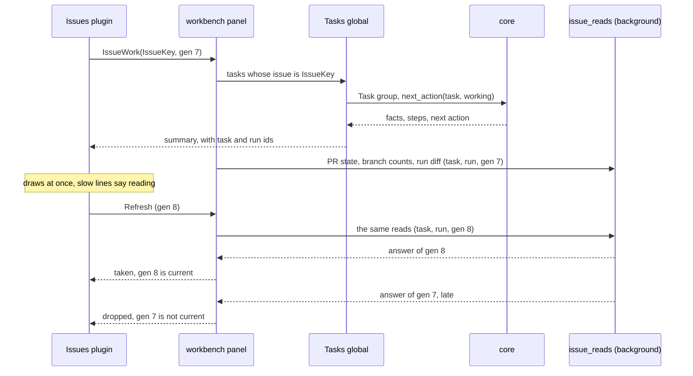
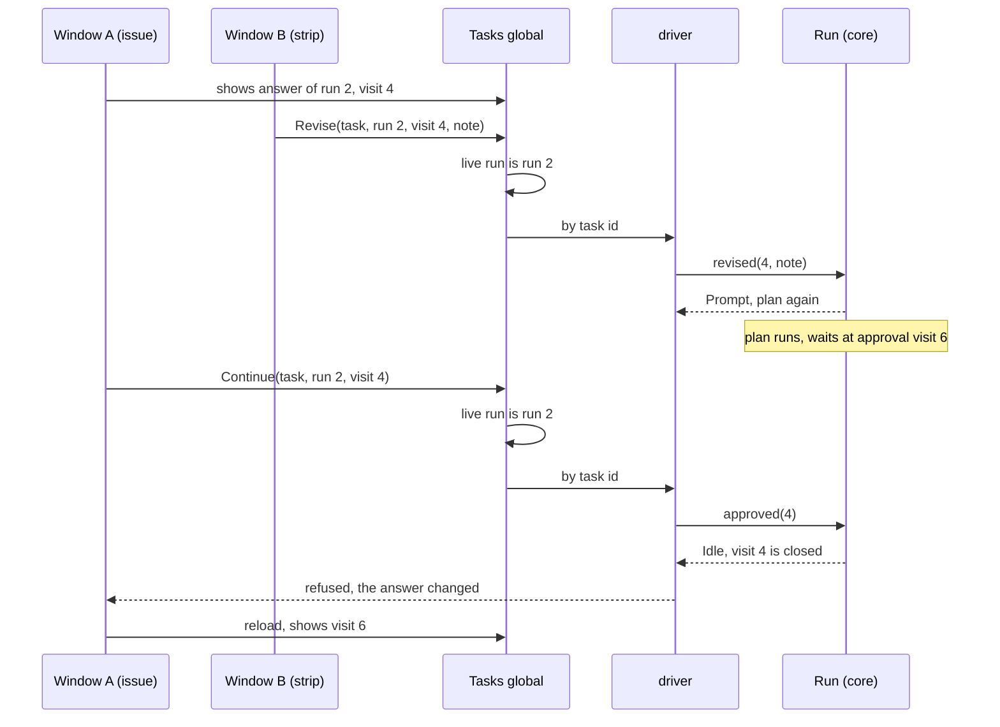
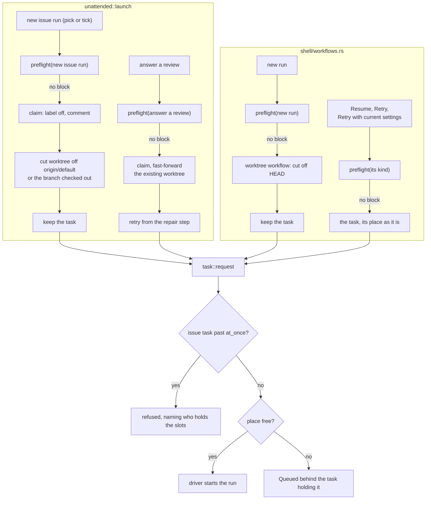
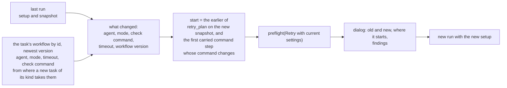

# Architecture of the proposal

- Status: proposal, the shape of every piece together. Part of [the proposal](README.md).
- The split is the one the code already has: **core decides, the app does, a plugin draws.** Every
  new rule below is a pure function in `crates/core`; the app gathers its inputs and carries out its
  answer; the Issues plugin draws what it is told through `onehand-plugin-host`.

## Where each part goes

Existing parts are plain; what the proposal adds is marked `+`, what it changes `~`.

```
crates/core (GUI-free, blocking)            crates/app (GPUI)                       plugins/builtin/workbench-issues
───────────────────────────────────         ─────────────────────────────────       ────────────────────────────────
workflow::run                               task (the Tasks global)                 view/detail.rs
  Run, Visit, Marks, Outcome (unchanged)      rows, attention, issue_runs             ~ runs_view → five regions, one order
  ~ approved(visit) / revised(visit, note)    ~ approve / revise: task, run, visit      + facts, step N of M, next action
  + Run::failure: Option<kind>     (B)          (run id checked before visit)         + Refresh, "read Xm ago"
  + Run::pull_request              (B)        + work_summary(task) → plugin           + short form (tab), full (page)
  + Visit::command                 (B)        + retry_with_current(task)              + template picker in the form
  retry_of, retry_plan                      task::driver                            view.rs
  + changed_commands(old, new) → start        ~ routes actions by task id             RootIssues: data, sync
task                                          ~ records failure kind, PR, command       (per view today; pages: below)
  Task, group, history                      unattended
  + next_action(task, working)                ~ placed() on a lost window (fix)     crates/plugin-host (workbench.rs)
  + work facts: run diff vs branch diff       + slots() for who holds each            Request::IssueRuns
+ preflight                                   launch: preflight → claim → cut         + Request::IssueWork(IssueKey,
  + preflight(kind, facts) → findings           → keep task → task::request             task, run, generation)
issues                                      + agent_modes (per spec, process only)    + approval actions carry
  LocalIssue, Draft, open_across            shell/workflows.rs                          task, run and visit
  + IssueKey { file, number }                 launcher: preflight → cut → request
  + templates (shipped, project's own)        begin_retry: preflight → request
  + lacks(body, template) → headings          + Retry with current settings dialog
  + across(state)            (pages)        dialogs.rs (pick_issue)
unattended                                    + preview + instructions for this run
  brief_for, Verdict, report                workbench/panel.rs
  ~ brief_for(.., extra instructions)         ~ broadcast + answer generation-checked reads
connector                                   + issue_reads (background)
  pull request by branch, merged head         PR state, branch counts, diffs
```

`(B)` is piece 1 part B: new persistence, optional fields beside the existing ones; no existing
shape changes (see [issue-progress.md](issue-progress.md#part-b-what-runs-start-keeping)).

## Issue identity

An issue is named by **the issues file it is kept in and its number**: `IssueKey { file, number }`,
the file being `issues::file_for(storage, root)`. That is the pair `task::issue_runs` already
matches a task's `TrackerRef` on. The project and number alone are not enough: two workspaces can
open one project, and each keeps its own issues file with its own issue 12. Every request, read and
action about an issue in this proposal carries an `IssueKey`, never `(root, number)`.

## Who owns the issues

Today **the plugin owns them**: each `IssuesView` holds a `RootIssues` per project
(`plugins/builtin/workbench-issues/src/view.rs`), with the issues, the sync state and the view's own
selection, filter and draft. Nothing else in the app holds an issue.

Piece 1's short form keeps that: it draws in that one view, and the app sends it work summaries
keyed by `IssueKey`.

The Issues page (piece 5, wave 1) needs a second view of the same issues, and that is **a refactor
of its own**, done before the page and in its PR:

| Shared, one per `IssueKey`'s file, owned by the app | Per view, owned by each view |
|---|---|
| the issues read from the file, writes to it, the sync with a forge and its pause, conflicts | the selected issue, filters, scroll, the new-issue or edit draft, the reads it asked for and their generations |

The shared part becomes an entity in the app, handed to the plugin through `onehand-plugin-host`
as the panel already hands it requests; the Workbench mode and the Issues page each subscribe to
it. A sync then runs once per file whatever the number of views, and an edit in one view is seen in
the other at once.

## The parts and who calls whom



## Flow: an issue opened

What the issue's view draws, and where each line comes from. In memory per frame, except the reads
that need git or the forge.



The generation is bumped by every read sent, so another issue, an out-of-order refresh and a Retry
that replaced the run are all dropped the same way. Reads are sent on opening, on *Refresh*, on the
task moving (`IssueRuns` broadcast), and on the window regaining focus when what is shown is older
than a minute.

## Flow: an approval from anywhere

One path for the strip, the task detail and the issue. The run id is checked before the visit id,
since visit ids count from 1 in every run.



An action naming a run that is not the task's live run is refused in the `Tasks` global and never
reaches the engine.

## Flow: a start, through the preflight

Every caller runs the preflight first with its own kind. Claiming and cutting stay with the callers
that do them today; `task::request` only asks for the place.



A block at any preflight refuses where it was asked, before anything is claimed, cut or started.
The slot is checked by the preflight and again by `task::request`, which keeps the check it has
today: a slot can fill between the two. A full slot refuses; only a place queues.

## Flow: Retry with current settings



*Retry* itself is unchanged: `retry_of` with the last run's setup. Labels and `[unattended]
workflow` are not asked: they choose the workflow of a new task, and a retry is the same task.

## What is stored, and where

```
<config_dir>/onehand/tasks/<id>.json        one per task, as today, no schema version
  runs[]
    outcome          unchanged, Failed(String) included
    failure          + kind                            absent → other
    pull_request     + { number, url }                 absent → looked up by branch
    visits[]
      command        + { passed, exit, tail, at }      absent → "not recorded"
  source.unsent[]    unchanged: reports keep Outcome as it is

<workspace storage>/issues/<project>.json   unchanged: no progress kept on an issue (issues::file_for)

in memory, this process only
  agent_modes        + spec fingerprint → modes offered
  issue reads        + per view: generation → (answer, read at)
```

Every new field is optional and added beside the old ones, so an older file reads unchanged. An
older build reading a newer file ignores the new fields and drops them when it saves; nothing can
refuse it, since task files carry no version. Nothing else is persisted: progress, the next action,
the three facts and every preflight finding are worked out each time from what is above.
