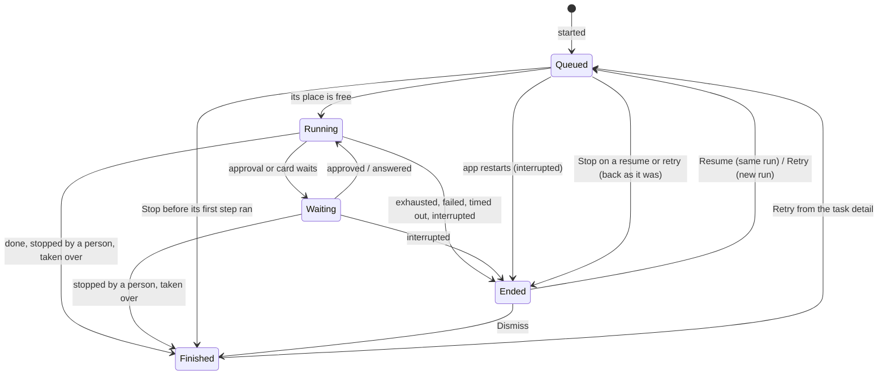

# Tasks

**Status: milestones 1+2 to 4 are built, and the first pull request of milestone 5.** Milestone 1+2
landed as pull requests 1 (the rename), 2 (tasks, history, step visits, marks and the queue) and 3
(the Tasks page, the check as a task, Retry and the history cap); milestone 3 added the task detail
and the earlier-step picker; milestone 5 began by making an issue a task's source. This is where
milestones 1+2 and 3 of [roadmap.md](roadmap.md) went, and the decisions behind it are listed
there. Where the code has landed, this file is its account, with [workflows.md](workflows.md)
holding the engine and the driver.

## What a person gets

One page that answers three questions about the work onehand does on their behalf: what is
running, what needs me, and what has finished.

- **The Tasks page** opens in the agent pane, from a rail row beside *Workspace overview*. The row
  shows how many tasks need attention, and shows nothing at zero. A keymap command opens it too, with
  no default key.
- **It covers the window's workspace** and can be filtered by project.
- **Four groups**, in this order:

  | Group | Holds | Row actions |
  |---|---|---|
  | *Needs attention*, waiting | a live run waiting for approval, or on a card its session parked; it keeps its place | Open session, Stop |
  | *Needs attention*, ended | a run that ended exhausted, failed, timed out or interrupted; its place is free | Resume (interrupted only), Retry, Dismiss |
  | *Running* | the one run working in each place | Open session, Stop |
  | *Queued* | tasks waiting for their place to be free | Stop |
  | *Finished* | done, stopped by a person, taken over, dismissed | none on its row; Retry in its detail |

- **Every entry in *Needs attention* comes with an action**, and it stays until a person takes one.
  A waiting run is answered in its session; an ended one is resumed, retried or dismissed. Dismiss
  moves it to *Finished* and keeps its outcome.
- **The project page links to this page** with one line, e.g. *2 tasks need attention · 1 queued*,
  drawn only when a task of the project needs attention, runs or waits, so two lists can never
  disagree. Beside *New session* it offers **Run check** when the project has a check command.
- **An unattended run is a task like any other**: an issue worked by the configured workflow,
  listed with the issue it works before its workflow's name (*#57 · Work an issue*), and stopped,
  resumed, retried and dismissed from its row. See [unattended.md](unattended.md).
- **History is bounded:** the most recent 200 finished tasks per project. The page says how many
  older ones were removed since onehand started.
- **Every card is capped at 50 rows** and says how many more it left out.

**The task detail** opens in place of the cards when a row's text is pressed, with *All tasks* to
go back. It shows:

- **a head**: the title, the row's muted line, and the row's actions, plus *Retry* on a finished
  task;
- **Awaiting approval**, while the last run waits on one: the step that answered and its answer
  (its last 60 lines, said when cut), with *Open session*. It is answered in its session, not here;
- **Run N**, the last run's timeline: one line per step visit (the step, why it ended, when it
  started and how long it took), each opening onto what it kept or printed (its last 60 lines) and
  the files it changed between its start and end marks, with their added and removed lines.
  Pressing a file shows its line diff in the transcript's diff renderer, cut at 400 lines; a binary
  file is listed but does not open. A visit under way, on a task at work, says *In progress*; an open
  visit of any other task was cut off by a quit or a lost session, says *Cut off* and gives no
  duration; one with a mark missing says *No marks were pinned for this visit.* The timeline draws the newest 100 visits and a visit lists 100 files, each cap said;
- **Earlier runs**, newest first and the newest 20 of them: the run's number, how it ended and
  when, each opening onto the same timeline.

What a visit changed and a file's diff are read off the UI thread when opened, from the run's
worktree, or from its project once the worktree is gone; while they are read the detail says so.

## The model

```
Task ──< Run ──< Step visit
 │        │        ├─ visit id, step id, started and ended at
 │        │        ├─ marks at its start and end ── refs/onehand/… in the repository
 │        │        └─ what it answered or printed, and how it came out
 │        ├─ snapshot of the workflow (frozen when the run starts)
 │        ├─ session it used
 │        └─ outcome
 ├─ source (the launcher, a project's check, an issue)
 ├─ brief (workflow tasks only)
 ├─ place (checkout or worktree + branch), shared by every run
 └─ outcome = the last run's outcome, or Dismissed
```

- **A task is the work. A run is one execution of it.** Retry starts a new run. Resume carries on
  the same run with its marks kept.
- **A task is anything with a lifecycle and an outcome:**
  - a run (today's `workflow::Run`);
  - the project's check command run on its own;
  - an issue worked unattended (`Source::Issue`), which also keeps where the issue lives and the
    reports it has not been given yet.

  A plain agent session is not a task and never appears on the page.
- **A workflow is the template.** "Pipeline" leaves the code and the screen. There is no
  "workflow run": a task uses a workflow, and each of its runs keeps a snapshot of it.
- **The place belongs to the task.** Every run works in the same checkout, or the same worktree and
  branch, so a retry sees the work the run before it left.

### The life of a task



*Waiting* and *Ended* are the two halves of *Needs attention*. **Every start goes through the
queue**, Resume and Retry included: a task resumed while another works in its place waits as
*Queued*. *Queued* that finds the place free moves straight on, so a person never sees it.
**Stop on a queued row calls off that start only**: a resume or retry goes back to *Ended* with its
earlier run untouched, and a task that never ran a step goes to *Finished*, stopped by a person,
with no empty run recorded.

**Queued, Running and Waiting hold the place; Ended and Finished do not.** A run gives its place up
only once its agent's turn is over and its command's process group has exited, never when Stop is
pressed, so the next task cannot start on work still being written.

Which group a task sits in is never stored: it is worked out from the task's last run, so the page
and the rail count cannot drift apart.

### Retry and Resume

| | Resume | Retry |
|---|---|---|
| Run | the same one | a new one |
| Offered for | an interrupted run only (the agent stopped or the session went: `Outcome::resumable`) | every outcome under *Needs attention*, and *Finished* from the detail; a dismissed task retried is live again |
| Workflow | the run's own snapshot | the previous run's snapshot; the newer template is offered if it changed |
| Starts at | where it was, marks kept | the first step that cannot be carried over (below), or an earlier one picked in the dialog; a run that got to the end starts at the first step by default |
| Misses | as they were | from zero |
| Place | through the queue | through the queue |

**What a retry carries over is decided step by step, from the first.** A step's output, and an
approval of it, carry over only while that step's configuration is the same in the workflow the
retry uses as in the one the previous run used, and so is everything it reads: the steps its
prompt names, the step it approves, its `on_fail`. The first step that differs, and everything
after it, runs again, approvals included. A step id kept with a new prompt is a different step.
With the previous run's own snapshot, nothing differs, so a retry starts where that run stopped.

**The work is compared with where the previous run left it**, its last visit's end mark:

- **Another branch checked out** refuses the retry, naming the branch to check out again: marks and
  outputs read against another branch would be wrong.
- **The work changed** (another head, or other uncommitted changes) is said in the retry dialog,
  and the retry still carries outputs over, since a person fixing something by hand is the usual
  reason to retry. The new run's first mark records the work as it now is.

A run cut off before its last visit ended is compared with that visit's start mark instead
(`Run::last_mark`). A retry with no mark to compare against, or whose comparison fails, skips this
check. **A check task is retried at once**, with no dialog: it is a fresh run of its one step.

**The dialog has a step menu**, *From …*, listing the first step up to where the retry would start;
it defaults to that start, or to the first step when the last run got to the end. The description
says where the pick starts and how many answers it carries; only the steps before it carry. The
pick goes to both *Retry* and *Retry with the newer workflow*, and a newer workflow without that
step ignores it.

In code: `Run::retry_start` (`crates/core/src/workflow/run.rs`) says where a retry would start,
`Run::retry_offered` which step the dialog offers first, and `Run::retry_plan` where a retry from a
picked step starts and how many answers it carries, which is what the dialog says. `Run::retry_of`
builds the new run from that plan, with `step` and `furthest` at its start and the outputs of the
steps before it. A step counts as passed by where it stood in the last run's own template, so
dropping an earlier step never moves a failed one into the past. `Task::retry` pushes it and
clears `dismissed`, so a task let go comes back live and a failure lands under *Needs attention*
again. A check is retried from its one step, so one that passed runs again.
`Run::resume` enters the run's own step on its first start, which is step 0 for a fresh run.
`task::marks::against_blocking` answers `Same`, `Changed` or `OtherBranch`, and
`Shell::begin_retry` (`crates/app/src/shell/workflows.rs`) asks the question. The dialog shows
*Retry with the newer workflow (version N)* when the workflows on offer hold one that is newer than
the run's snapshot (`Template::newer_than`: the same id at a higher version, or at the same version with different
content, as a hand edit leaves it; or for a snapshot from
before ids the same name with different content) and validates, and it says where that one would
start.

## The architecture

The split stays the one the engine already has: **core decides, the app does.** Nothing below adds
an async runtime to core or a GUI dependency to it.

```
crates/core (GUI-free, blocking)          crates/app (GPUI)
─────────────────────────────────         ──────────────────────────────────────
workflow::template / validate / store     settings: Workflows
workflow::run   (the engine; today's      task::driver      ── session events → reports
                 workflow::Run)                 │  (unchanged in kind: still the only one)
task            (Task, Run list,                ▼
                 outcome, group rule)     Tasks global on Shared ── one per process
task::queue     (who may run where)            │  owns every task, its lock and queue,
task::files     (Writer, one thread)           │  and the session uid → task index
task::marks     (commit objects + refs)        ▼
unattended      (the issue a task works,  Tasks page in the agent pane, rail row
                 its branch and report)
```

### Core

- **The engine does not change in kind.** `workflow::Run` (`PipelineRun` before the rename) stays, and
  goes on taking reports and answering with the next `Action`. A task wraps its runs; it does not
  move transitions out of the engine.
- **`Task`** (`crates/core/src/task.rs`) holds its id (its first run's), its brief and setup (the
  project and place), the list of its runs, and whether it was dismissed. Brief and setup are kept
  on the task as well as on each run, so a task called off before its run started still says what
  it was. `Task::outcome` is the last run's, or stopped by a person with no run; `Task::resumable`
  is not dismissed and that outcome unset or resumable. Both are written once in core, as
  `GitStatus::label` is, never per call site. `Task::source` is `Workflow`, `Check` or `Issue`, and a
  file from before it reads as `Workflow`. A task whose issue still waits for a report is never
  past the history cap.
- **The group rule is pure** (`Task::group`). The app passes what only it knows, `Working::Queued`,
  `Running` or `Waiting`, which maps straight to its group. Otherwise a task not dismissed whose
  outcome is unset (cut off) or `Outcome::needs_attention` (exhausted, failed, timed out, agent or
  session gone) is *Ended*, and everything else is *Finished*.
- **The history cap is pure** (`task::history::over_cap`): the ids of the *Finished* tasks past the
  newest `KEPT` (200) of each project a task was started from (`setup.repo`, never a worktree).
  Recency is the latest move across a task's runs, then its id, which is the nanos it was made at.
- **The queue rule is pure** (`task::queue::Queue`). Given a place, it answers whether a start runs
  now or queues, and which queued task goes next when a place frees up (first in, first out). Every task
  holds its place's lock, a single command included, so a check waits behind a workflow that is
  still editing. A plain session holds no lock.
- **A place is the checkout git sees, not the path a project was opened at.** The lock is keyed by
  the canonical path of the worktree's top level (`git rev-parse --show-toplevel`, symlinks
  resolved), so two projects that are folders of one checkout, or one checkout reached through a
  symlink, share one lock. A folder outside git is keyed by its own canonical path
  (`task::queue::place_blocking`).
- **A run is a list of step visits.** Going back to a step, after a failed command or a revision,
  is a new visit, never a rewrite of the last one: `implement → verify (fails) → implement` is three
  visits. Each keeps its own id, times, marks, output and result, which is what milestone 3's
  timeline is drawn from (`workflow::Visit`). Resuming closes the cut-off visit as `interrupted`
  and opens a new one of the same step. Visits are not capped: each ends on a miss or a person.
  The run also keeps its `Outcome` now, so a run with none after a restart reads as interrupted.
- **Marks carry a commit object.** Today a `Mark` is a head and a fingerprint of the uncommitted
  work, enough to tell whether two states differ but not to rebuild a diff. Each visit gets a mark
  at its start and its end, and each mark gains a commit made like this:

  ```
  GIT_INDEX_FILE=<temp> git read-tree HEAD
  GIT_INDEX_FILE=<temp> git add -A
  tree=$(GIT_INDEX_FILE=<temp> git write-tree)
  commit=$(git commit-tree $tree -p HEAD -m "onehand mark")
  git update-ref refs/onehand/tasks/<task>/<run>/<visit>/<start|end> $commit
  ```

  The visit id is in the path, so a step visited twice keeps both pairs. The commit's message also
  carries `Branch: <name>`, the branch checked out when it was pinned, so a retry can tell the work
  moved to another branch without the run's schema changing; a mark from before it names none, and
  the branch check is skipped for it. `task::marks::pin_blocking`
  does this with onehand's own author and committer, so a repository with no identity set still
  gets its marks, and reads an empty tree on an unborn `HEAD`. One commit serves a visit's end and
  the next visit's start (`Run::boundaries`, `Run::pinned`).

  It is not `git stash create`, which leaves untracked files out and makes a commit nothing points
  at, so `git gc` prunes it within weeks. The temporary index leaves the person's own index alone.
  The refs are deleted when their task falls out of the history cap
  (`task::marks::drop_blocking`, every ref under `refs/onehand/tasks/<task>/`).
- **One writer, in order.** `task::files::Writer` is the task store's writer: one thread, saves
  carried out in the order sent, `flush` on quit. A finished task's file is kept as history until the
  history cap removes it through the same thread (`Writer::remove`), so a save still queued cannot
  bring a removed file back.

### On disk

```
<config_dir>/onehand/
  workflows/<slug>.toml      was pipelines/, moved at boot
  tasks/<id>.json            one per task, unfinished or in the history; replaces pipeline-runs/
```

The move runs at every boot until there is nothing left to move, and **is safe to stop at any
point and run again**:

- **Each file moves on its own:** the new file is written in full (to a temporary name, then
  renamed into place), and only then is the old one removed. A crash between the two leaves both,
  and the next boot finishes the job.
- **Ids are stable.** A migrated task takes the old run's id, so a file found in both places
  becomes one task, never two. A template already in `workflows/` under the same slug is kept, and
  the old copy is removed.
- **A file this build cannot read is left where it is**, untouched, and listed as unreadable, the
  rule `schema_version` already keeps.
- **An old directory is removed only once it is empty.**

Every old run becomes a task with one interrupted run. There is no way back to an older build,
which this pre-release accepts; that does not excuse a move that can lose a file.

### One instance

**Only one onehand runs on a config directory.** At boot it takes `File::lock` on
`<config_dir>/onehand/instance.lock` and holds it for its life; the kernel lets go if the process
dies. A second instance says that onehand is already running and exits. Without it, two processes
would each hold their own place locks, both run the migration and both write `tasks/`, and the one
ordered writer would be two. More windows open in the one process, as now. It lands with the first
pull request, before the migration it protects.

### The app

- **One `Tasks` global** (`crates/app/src/task.rs`) owns every task, the queue, the runs under way
  by session uid (so the driver still finds its run from a session event), the window each queued
  task was asked from, and the tasks still draining. `Workflows` keeps only the templates on offer.
- **Every start goes through `task::request`**: the launcher keeps the task first, then asks; Resume
  asks too. A free place starts the task at once (`Shell::drive_task`); a taken one queues it and
  says so in a notification. A task already running or waiting is left alone.
- **The driver stays the only code that turns session events into reports.** It gained two
  duties: pinning the work at every boundary a step change crosses, before the step's first action,
  and handing an ended run to the global. That one keeps the place until the session's turn is over
  (or its agent or session goes), pins the last end mark, then releases the place and starts the
  next task in the window it was asked from; one whose window or folder is gone stays interrupted,
  and the place passes on.
- **The page reads its rows per frame** from `task::rows`, the window's tasks (by `setup.repo` or
  `setup.dir`), sorted by `task::sort_listed`
  (core): by group, finished rows by when they last moved, newest first, every other group by
  when the task was made, oldest first. The rail's count is `task::attention`, counted from the same
  rows. `Tasks::working` says what a task does: queued, waiting (an approval or an unanswered card
  on its live driver), or running (a live driver, a place held, a check running).
- **Stop goes through `task::stop_task`**, whatever the task does: a queued one is called off, a
  live driver is stopped, and a running check has its command called off. A task that ended but
  still holds its place, its session's turn not yet over, has nothing to stop, and its row offers
  no *Stop*.
- **The check command as a task** (`Task::check`) is a run of a template named *Check* with one
  command step whose `on_fail` is empty, so a failure ends the run failed. The template is made on
  the spot and never saved or validated. *Run check* on the project page keeps the task and asks
  for its place like any other. With no session to watch, the driver is not involved:
  `task::drive_check` pins the start mark, runs the command on the background executor with a
  cancel flag, reports `command_finished` (passed on the exit status alone, so a folder outside
  git or a repository with no commit passes too) (or `stopped` by a person when called off), says *Check
  passed in <project>* or *Check failed in <project>* in the window it was asked from, then pins the end mark
  and gives the place up.
- **The history cap runs** once the tasks are read at boot and whenever a task lets go of its
  place, is dismissed or is called off. Each task past the cap has its file removed, leaves the
  global, and has its marks dropped off the UI thread; a failure is logged. How many went is counted
  per project since boot only.
- **An unattended run is a task of its own source** (`Source::Issue`). Its session is started off
  screen, its run is driven by the same driver, and when its place is freed the issue is told how
  it ended through the reports the task keeps (`crate::unattended::ended`).
- **After a restart nothing starts by itself.** A task that was running or queued comes back
  interrupted, under *Needs attention*, and waits for Resume.
- **Worktrees are never removed by onehand.** A task's worktree may hold unpushed commits. The merged
  pull request of milestone 5 is the first signal clear enough to clean up on.

## What changes where

Milestone 1+2 lands as three pull requests in a row, each with its docs.

| Pull request | Core | App |
|---|---|---|
| 1. Rename and migration (landed) | `workflow` (was `pipeline`), `workflow::Run` (was `PipelineRun`); `workflow::store::migrate_old_dir_blocking` moves `pipelines/` to `workflows/`, restartably; `instance::hold_lock` | `boot` takes the lock, then runs the move; every module, type and string renamed, the `Workflows` global and Settings ▸ Workflows; a `run_pipeline` keymap override is read as `run_workflow` |
| 2. Tasks, history, visits and the queue (landed) | `task`, `task::files` and the move of `pipeline-runs/`; step visits; `task::marks`; `task::queue` keyed by the real checkout | `Workflows` → `Tasks` global; the driver records visits and marks their end; every start asks the queue, and a place is given up only once the work has stopped |
| 3. The Tasks page, the check as a task, and Retry (landed) | group rule, history cap; a one-step run with no agent; what a retry carries over | page, rail row and count, project filter; the project page links here; Retry from *Needs attention* |
| Milestone 4: the workflow library (landed) | `Template::id`, `version` and `newer_than`, set by `store::save_blocking`; unknown keys refused; fuller validation; `first_prompt`, `StepSpec::summary`, `store::export_blocking` | Import and Export in Settings ▸ Workflows; the launcher's preview; Retry offers the newer workflow by id |
| Milestone 3: the task detail (landed) | `Visit` public; `Run::retry_start`, `retry_of` from an earlier step; `Task::retry` clears `dismissed`; `task::marks::changes_blocking` and `file_diff_blocking` | the detail in `chat/pane/tasks_page.rs`; the retry dialog's step menu |
| Milestone 5, pull request A: an issue as a source (landed) | `Source::Issue(IssueSource)`, its unsent reports kept past the cap; `Setup::mode`; branches by tracker; `report` from an `Outcome`; `room`; the shipped *Work an issue* | the tick and a pick start a task; an issue task driven off screen; the mode set when the agent comes up; reports sent and retried; the cap `at_once`; the read-only rows gone |

Each one brings its glossary terms and turns its part of this file into the account of the code.

## Not in this design

- **A cap on concurrency across every task.** Only unattended runs are capped (`[unattended]
  at_once`); a task a person starts waits only for its place.
- **Arbitrary commands as tasks.** Only the project's check command, until a real need shows.
- **Plain sessions on the page.** A card a plain session parks is signalled on the rail, as now.
- **Warning when a task starts beside a person's own session** in the same checkout.
