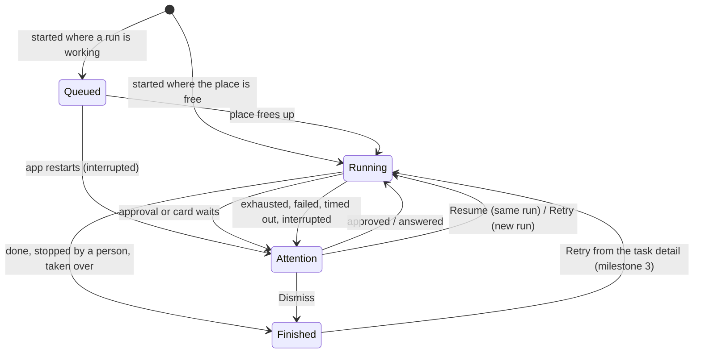

# Tasks

**Status: design.** Nothing here is built yet. This is where milestones 1+2 and 3 of
[roadmap.md](roadmap.md) are headed, and the decisions behind it are listed there. When the code
lands, this file becomes its account, the way [pipelines.md](pipelines.md) is for the engine.

## What a person gets

One page that answers three questions about the work onehand does on their behalf: what is
running, what needs me, and what has finished.

- **The Tasks page** opens in the agent pane, from a rail row beside *Workspace overview*. The row
  shows how many tasks need attention, and shows nothing at zero. A keymap command opens it too, with
  no default key.
- **It covers the window's workspace** and can be filtered by project.
- **Four groups**, in this order:

  | Group | Holds | Row actions |
  |---|---|---|
  | *Needs attention* | a run waiting for approval; a card a task's session parked; a run that ended exhausted, failed, timed out or interrupted | Open session, Resume (interrupted only), Retry, Dismiss |
  | *Running* | the one run working in each place | Open session, Stop |
  | *Queued* | tasks waiting for their place to be free | Open session, Stop |
  | *Finished* | done, stopped by a person, taken over, dismissed | none on this page |

- **Every entry in *Needs attention* comes with an action**, and it stays until a person takes one.
  Dismiss moves it to *Finished* and keeps its outcome.
- **The project page's list of unfinished runs becomes a link to this page**, so two lists can never
  disagree.
- **History is bounded:** the most recent 200 finished tasks per project. The page says how many
  older ones were removed.

Milestone 3 adds the task detail behind each row: each run's step timeline, each step's output and
diff, what waits for approval, the earlier runs, and Retry for a finished task.

## The model

```
Task ──< Run ──< Step visit
 │        │
 │        ├─ snapshot of the workflow (frozen when the run starts)
 │        ├─ marks at each step's start and end ── refs/onehand/… in the repository
 │        ├─ session it used
 │        └─ outcome
 ├─ source (the launcher, a project's check, later an issue)
 ├─ brief (workflow tasks only)
 ├─ place (checkout or worktree + branch), shared by every run
 └─ outcome = the last run's outcome, or Dismissed
```

- **A task is the work. A run is one execution of it.** Retry starts a new run. Resume carries on
  the same run with its marks kept.
- **A task is anything with a lifecycle and an outcome:**
  - a workflow run (today's `PipelineRun`);
  - the project's check command run on its own;
  - an unattended run, shown read-only until milestone 5.

  A plain agent session is not a task and never appears on the page.
- **A workflow is the template.** "Pipeline" leaves the code and the screen. There is no
  "workflow run": a task uses a workflow, and each of its runs keeps a snapshot of it.
- **The place belongs to the task.** Every run works in the same checkout, or the same worktree and
  branch, so a retry sees the work the run before it left.

### The life of a task



*Attention* is the *Needs attention* group. Which group a task sits in is never stored: it is
worked out from the task's last run, so the page and the rail count cannot drift apart.

### Retry and Resume

| | Resume | Retry |
|---|---|---|
| Run | the same one | a new one |
| Offered for | an interrupted run only (the agent stopped or the session went: `Outcome::resumable`) | every outcome under *Needs attention*, and *Finished* from the detail |
| Workflow | the run's own snapshot | the previous run's snapshot; the newer template is offered if it changed |
| Starts at | where it was, marks kept | the step the previous run stopped at, with the outputs of the steps before it; an earlier step can be picked |
| Misses | as they were | from zero |

The newer template is offered only when the step the run stopped at, and every step before it,
still exist under the same ids. Otherwise the person picks the step to start from, and outputs that
no longer match are dropped.

## The architecture

The split stays the one the engine already has: **core decides, the app does.** Nothing below adds
an async runtime to core or a GUI dependency to it.

```
crates/core (GUI-free, blocking)          crates/app (GPUI)
─────────────────────────────────         ──────────────────────────────────────
workflow::template / validate / store     settings: Workflows
workflow::run   (the engine; today's      workflow::driver  ── session events → reports
                 PipelineRun)                   │  (unchanged in kind: still the only one)
task            (Task, Run list,                ▼
                 outcome, group rule)     Tasks global on Shared ── one per process
task::queue     (who may run where)            │  owns every task, its lock and queue,
task::files     (Writer, one thread)           │  and the session uid → task index
task::marks     (commit objects + refs)        ▼
unattended      (as it is; a thin         Tasks page in the agent pane, rail row
                 conversion feeds the page)
```

### Core

- **The engine does not change in kind.** `PipelineRun` becomes `workflow::Run` in the rename, and
  goes on taking reports and answering with the next `Action`. A task wraps its runs; it does not
  move transitions out of the engine.
- **`Task`** holds its id, source, brief or command, place, project, the list of its runs, and
  whether it was dismissed. Its outcome and its group are functions of that state, written once in
  core, as `GitStatus::label` is, never per call site.
- **The queue rule is pure.** Given the tasks and a place, it answers whether a new task runs now or
  queues, and which queued task goes next when a place frees up (first in, first out). Every task
  holds its place's lock, a single command included, so a check waits behind a workflow that is
  still editing. A plain session holds no lock.
- **Marks carry a commit object.** Today a `Mark` is a head and a fingerprint of the uncommitted
  work, enough to tell whether two states differ but not to rebuild a diff. Each step gets a mark at
  its start and its end, and each mark gains a commit made like this:

  ```
  GIT_INDEX_FILE=<temp> git read-tree HEAD
  GIT_INDEX_FILE=<temp> git add -A
  tree=$(GIT_INDEX_FILE=<temp> git write-tree)
  commit=$(git commit-tree $tree -p HEAD -m "onehand mark")
  git update-ref refs/onehand/tasks/<task>/<run>/<step>-<start|end> $commit
  ```

  It is not `git stash create`, which leaves untracked files out and makes a commit nothing points
  at, so `git gc` prunes it within weeks. The temporary index leaves the person's own index alone.
  The refs are deleted when their task falls out of the history cap.
- **One writer, in order.** `pipeline::files::Writer` becomes the task store's writer: one thread,
  saves and removals carried out in the order sent, `flush` on quit. The difference is that a
  finished task's file is kept as history instead of removed.

### On disk

```
<config_dir>/onehand/
  workflows/<slug>.toml      was pipelines/, moved once at boot
  tasks/<id>.json            one per task, unfinished or in the history; replaces pipeline-runs/
```

The move happens once, at the first boot of the build that brings it: `pipelines/` is renamed and
every `pipeline-runs/*.json` becomes a task with one interrupted run. There is no way back to an
older build, which this pre-release accepts. `schema_version` keeps its rule: a file this build
cannot read is listed as unreadable and never written over.

### The app

- **One `Tasks` global** replaces today's `Pipelines`, which holds runs by session uid. It owns every
  task, applies the queue rule, and keeps a session uid → task index so the driver still finds its
  run from a session event.
- **The driver stays the only code that turns session events into reports.** It gains two
  duties: taking a mark at each step's end as well as its start, and telling the global when a run
  ends, so the queue can start the next task in that place.
- **The check command as a task** is a run with one command step and no agent. It goes through the
  same queue and the same writer, and its outcome lands on the page like any other.
- **Unattended runs are read through a conversion** that turns what `onehand_core::unattended`
  already knows into rows. Their data and code are left alone until milestone 5 replaces the
  one-turn run, when an unattended run becomes a run of a task for real.
- **After a restart nothing starts by itself.** A task that was running or queued comes back
  interrupted, under *Needs attention*, and waits for Resume.
- **Worktrees are never removed by onehand.** A task's worktree may hold unpushed commits. The merged
  pull request of milestone 5 is the first signal clear enough to clean up on.

## What changes where

| Commit in 1+2 | Core | App |
|---|---|---|
| 1. Rename | `pipeline` → `workflow`, `PipelineRun` → `Run`, config dir moved | every module, type and string; Settings ▸ Workflows |
| 2. Task model and store | `task`, `task::files`; `pipeline-runs/` migrated | `Pipelines` → `Tasks` global |
| 3. Marks that rebuild a diff | `Mark` gains a commit; `task::marks` makes and drops refs | driver marks each step's end |
| 4. Lock and queue | `task::queue` | starting a task asks the queue; ending one releases its place |
| 5. Tasks page | group rule, history cap | page, rail row and count, project filter; the project page links here |
| 6. Check as a task, Retry | a one-step run with no agent; retry's start step | Retry from *Needs attention* |
| 7. Docs | glossary terms | this file becomes the account of the code |

## Not in this design

- **A cap on concurrency across the workspace.** The per-place lock comes first because two runs
  editing one checkout is the failure possible today. The cap arrives with milestone 5, before
  issues are taken up automatically.
- **Arbitrary commands as tasks.** Only the project's check command, until a real need shows.
- **Plain sessions on the page.** A card a plain session parks is signalled on the rail, as now.
- **Warning when a task starts beside a person's own session** in the same checkout.
- **Template versions, import and export**, which are milestone 4's.
