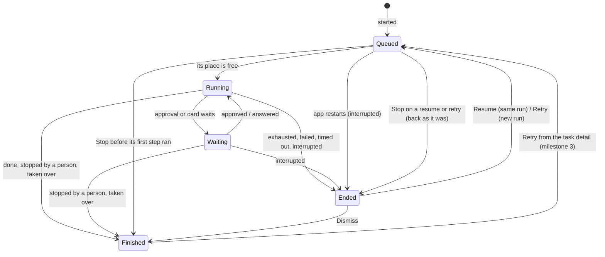

# Tasks

**Status: design.** Only pull request 1, the rename, is built. This is where milestones 1+2 and 3 of
[roadmap.md](roadmap.md) are headed, and the decisions behind it are listed there. When the code
lands, this file becomes its account, the way [workflows.md](workflows.md) is for the engine.

## What a person gets

One page that answers three questions about the work onehand does on their behalf: what is
running, what needs me, and what has finished.

- **The Tasks page** opens in the agent pane, from a rail row beside *Workspace overview*. The row
  shows how many tasks need attention, and shows nothing at zero. A keymap command opens it too, with
  no default key.
- **It covers the window's workspace** and can be filtered by project.
- **Four groups**, in this order:

  | Group | Holds | Row actions |
  |---|---|---|
  | *Needs attention*, waiting | a live run waiting for approval, or on a card its session parked; it keeps its place | Open session, Stop |
  | *Needs attention*, ended | a run that ended exhausted, failed, timed out or interrupted; its place is free | Resume (interrupted only), Retry, Dismiss |
  | *Running* | the one run working in each place | Open session, Stop |
  | *Queued* | tasks waiting for their place to be free | Open session, Stop |
  | *Finished* | done, stopped by a person, taken over, dismissed | none on this page |

- **Every entry in *Needs attention* comes with an action**, and it stays until a person takes one.
  A waiting run is answered in its session; an ended one is resumed, retried or dismissed. Dismiss
  moves it to *Finished* and keeps its outcome.
- **The project page's list of unfinished runs becomes a link to this page**, so two lists can never
  disagree.
- **History is bounded:** the most recent 200 finished tasks per project. The page says how many
  older ones were removed.

Milestone 3 adds the task detail behind each row: each run's step timeline, each step's output and
diff, what waits for approval, the earlier runs, and Retry for a finished task.

## The model

```
Task ──< Run ──< Step visit
 │        │        ├─ visit id, step id, started and ended at
 │        │        ├─ marks at its start and end ── refs/onehand/… in the repository
 │        │        └─ what it answered or printed, and how it came out
 │        ├─ snapshot of the workflow (frozen when the run starts)
 │        ├─ session it used
 │        └─ outcome
 ├─ source (the launcher, a project's check, later an issue)
 ├─ brief (workflow tasks only)
 ├─ place (checkout or worktree + branch), shared by every run
 └─ outcome = the last run's outcome, or Dismissed
```

- **A task is the work. A run is one execution of it.** Retry starts a new run. Resume carries on
  the same run with its marks kept.
- **A task is anything with a lifecycle and an outcome:**
  - a run (today's `workflow::Run`);
  - the project's check command run on its own;
  - an unattended run, shown read-only until milestone 5.

  A plain agent session is not a task and never appears on the page.
- **A workflow is the template.** "Pipeline" leaves the code and the screen. There is no
  "workflow run": a task uses a workflow, and each of its runs keeps a snapshot of it.
- **The place belongs to the task.** Every run works in the same checkout, or the same worktree and
  branch, so a retry sees the work the run before it left.

### The life of a task



*Waiting* and *Ended* are the two halves of *Needs attention*. **Every start goes through the
queue**, Resume and Retry included: a task resumed while another works in its place waits as
*Queued*. *Queued* that finds the place free moves straight on, so a person never sees it.
**Stop on a queued row calls off that start only**: a resume or retry goes back to *Ended* with its
earlier run untouched, and a task that never ran a step goes to *Finished*, stopped by a person,
with no empty run recorded.

**Queued, Running and Waiting hold the place; Ended and Finished do not.** A run gives its place up
only once its agent's turn is over and its command's process group has exited, never when Stop is
pressed, so the next task cannot start on work still being written.

Which group a task sits in is never stored: it is worked out from the task's last run, so the page
and the rail count cannot drift apart.

### Retry and Resume

| | Resume | Retry |
|---|---|---|
| Run | the same one | a new one |
| Offered for | an interrupted run only (the agent stopped or the session went: `Outcome::resumable`) | every outcome under *Needs attention*, and *Finished* from the detail |
| Workflow | the run's own snapshot | the previous run's snapshot; the newer template is offered if it changed |
| Starts at | where it was, marks kept | the first step that cannot be carried over (below); an earlier step can be picked |
| Misses | as they were | from zero |
| Place | through the queue | through the queue |

**What a retry carries over is decided step by step, from the first.** A step's output, and an
approval of it, carry over only while that step's configuration is the same in the workflow the
retry uses as in the one the previous run used, and so is everything it reads: the steps its
prompt names, the step it approves, its `on_fail`. The first step that differs, and everything
after it, runs again, approvals included. A step id kept with a new prompt is a different step.
With the previous run's own snapshot, nothing differs, so a retry starts where that run stopped.

**The work is compared with where the previous run left it**, its last visit's end mark:

- **Another branch checked out** refuses the retry, naming the branch to check out again: marks and
  outputs read against another branch would be wrong.
- **The work changed** (another head, or other uncommitted changes) is said in the retry dialog,
  and the retry still carries outputs over, since a person fixing something by hand is the usual
  reason to retry. The new run's first mark records the work as it now is.

## The architecture

The split stays the one the engine already has: **core decides, the app does.** Nothing below adds
an async runtime to core or a GUI dependency to it.

```
crates/core (GUI-free, blocking)          crates/app (GPUI)
─────────────────────────────────         ──────────────────────────────────────
workflow::template / validate / store     settings: Workflows
workflow::run   (the engine; today's      workflow::driver  ── session events → reports
                 workflow::Run)                 │  (unchanged in kind: still the only one)
task            (Task, Run list,                ▼
                 outcome, group rule)     Tasks global on Shared ── one per process
task::queue     (who may run where)            │  owns every task, its lock and queue,
task::files     (Writer, one thread)           │  and the session uid → task index
task::marks     (commit objects + refs)        ▼
unattended      (as it is; a thin         Tasks page in the agent pane, rail row
                 conversion feeds the page)
```

### Core

- **The engine does not change in kind.** `workflow::Run` (`PipelineRun` before the rename) stays, and
  goes on taking reports and answering with the next `Action`. A task wraps its runs; it does not
  move transitions out of the engine.
- **`Task`** holds its id, source, brief or command, place, project, the list of its runs, and
  whether it was dismissed. Its outcome and its group are functions of that state, written once in
  core, as `GitStatus::label` is, never per call site.
- **The queue rule is pure.** Given the tasks and a place, it answers whether a start runs now or
  queues, and which queued task goes next when a place frees up (first in, first out). Every task
  holds its place's lock, a single command included, so a check waits behind a workflow that is
  still editing. A plain session holds no lock.
- **A place is the checkout git sees, not the path a project was opened at.** The lock is keyed by
  the canonical path of the worktree's top level (`git rev-parse --show-toplevel`, symlinks
  resolved), so two projects that are folders of one checkout, or one checkout reached through a
  symlink, share one lock. A folder outside git is keyed by its own canonical path.
- **A run is a list of step visits.** Going back to a step, after a failed command or a revision,
  is a new visit, never a rewrite of the last one: `implement → verify (fails) → implement` is three
  visits. Each keeps its own id, times, marks, output and result, which is what milestone 3's
  timeline is drawn from.
- **Marks carry a commit object.** Today a `Mark` is a head and a fingerprint of the uncommitted
  work, enough to tell whether two states differ but not to rebuild a diff. Each visit gets a mark
  at its start and its end, and each mark gains a commit made like this:

  ```
  GIT_INDEX_FILE=<temp> git read-tree HEAD
  GIT_INDEX_FILE=<temp> git add -A
  tree=$(GIT_INDEX_FILE=<temp> git write-tree)
  commit=$(git commit-tree $tree -p HEAD -m "onehand mark")
  git update-ref refs/onehand/tasks/<task>/<run>/<visit>/<start|end> $commit
  ```

  The visit id is in the path, so a step visited twice keeps both pairs.

  It is not `git stash create`, which leaves untracked files out and makes a commit nothing points
  at, so `git gc` prunes it within weeks. The temporary index leaves the person's own index alone.
  The refs are deleted when their task falls out of the history cap.
- **One writer, in order.** `workflow::files::Writer` becomes the task store's writer: one thread,
  saves and removals carried out in the order sent, `flush` on quit. The difference is that a
  finished task's file is kept as history instead of removed.

### On disk

```
<config_dir>/onehand/
  workflows/<slug>.toml      was pipelines/, moved at boot
  tasks/<id>.json            one per task, unfinished or in the history; replaces pipeline-runs/
```

The move runs at every boot until there is nothing left to move, and **is safe to stop at any
point and run again**:

- **Each file moves on its own:** the new file is written in full (to a temporary name, then
  renamed into place), and only then is the old one removed. A crash between the two leaves both,
  and the next boot finishes the job.
- **Ids are stable.** A migrated task takes the old run's id, so a file found in both places
  becomes one task, never two. A template already in `workflows/` under the same slug is kept, and
  the old copy is removed.
- **A file this build cannot read is left where it is**, untouched, and listed as unreadable, the
  rule `schema_version` already keeps.
- **An old directory is removed only once it is empty.**

Every old run becomes a task with one interrupted run. There is no way back to an older build,
which this pre-release accepts; that does not excuse a move that can lose a file.

### One instance

**Only one onehand runs on a config directory.** At boot it takes `File::lock` on
`<config_dir>/onehand/instance.lock` and holds it for its life; the kernel lets go if the process
dies. A second instance says that onehand is already running and exits. Without it, two processes
would each hold their own place locks, both run the migration and both write `tasks/`, and the one
ordered writer would be two. More windows open in the one process, as now. It lands with the first
pull request, before the migration it protects.

### The app

- **One `Tasks` global** replaces today's `Workflows`, which holds runs by session uid. It owns every
  task, applies the queue rule, and keeps a session uid → task index so the driver still finds its
  run from a session event.
- **The driver stays the only code that turns session events into reports.** It gains two
  duties: taking a mark at each step's end as well as its start, and telling the global when a run
  ends, so the queue can start the next task in that place.
- **The check command as a task** is a run with one command step and no agent. It goes through the
  same queue and the same writer, and its outcome lands on the page like any other.
- **Unattended runs are read through a conversion** that turns what `onehand_core::unattended`
  already knows into rows. Their data and code are left alone until milestone 5 replaces the
  one-turn run, when an unattended run becomes a run of a task for real.
- **After a restart nothing starts by itself.** A task that was running or queued comes back
  interrupted, under *Needs attention*, and waits for Resume.
- **Worktrees are never removed by onehand.** A task's worktree may hold unpushed commits. The merged
  pull request of milestone 5 is the first signal clear enough to clean up on.

## What changes where

Milestone 1+2 lands as three pull requests in a row, each with its docs.

| Pull request | Core | App |
|---|---|---|
| 1. Rename and migration (landed) | `workflow` (was `pipeline`), `workflow::Run` (was `PipelineRun`); `workflow::store::migrate_blocking` moves `pipelines/` to `workflows/`, restartably; `instance::hold_lock` | `boot` takes the lock, then runs the move; every module, type and string renamed, the `Workflows` global and Settings ▸ Workflows; a `run_pipeline` keymap override is read as `run_workflow` |
| 2. Tasks, history, visits and the queue | `task`, `task::files` and the move of `pipeline-runs/`; step visits; `task::marks`; `task::queue` keyed by the real checkout | `Workflows` → `Tasks` global; the driver records visits and marks their end; every start asks the queue, and a place is given up only once the work has stopped |
| 3. The Tasks page, the check as a task, and Retry | group rule, history cap; a one-step run with no agent; what a retry carries over | page, rail row and count, project filter; the project page links here; Retry from *Needs attention* |

Each one brings its glossary terms and turns its part of this file into the account of the code.

## Not in this design

- **A cap on concurrency across the workspace.** The per-place lock comes first because two runs
  editing one checkout is the failure possible today. The cap arrives with milestone 5, before
  issues are taken up automatically.
- **Arbitrary commands as tasks.** Only the project's check command, until a real need shows.
- **Plain sessions on the page.** A card a plain session parks is signalled on the rail, as now.
- **Warning when a task starts beside a person's own session** in the same checkout.
- **Template versions, import and export**, which are milestone 4's.
